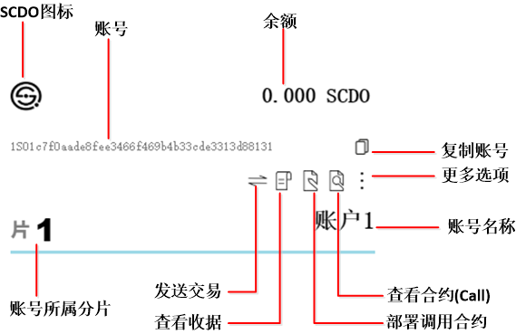

# 账户

## 账户管理

**导入**

1. 点击【导入账户】（菜单 > 文件 > 导入账户）打开文件浏览器。
2. 点击您要导入的账户文件。这里账户文件指的是密钥文件(keyfile)。
3. 点击【导入】确认导入，或点击【取消】退出导入。

**创建**

1. 点击【创建账户】（菜单 > 文件 > 创建账户）显示创建面板。
2. 输入账户名：不可与钱包内已有账户名重复、不可为空。
3. 可以选择是否输入私钥：
    1. 输入私钥，则使用已有私钥创建：输入0x开头共66位的SCDO私钥。例：```0x0fb46105b962b90d11ca7dcdee2551ec9ed3110b888c24a0832b84a57ca6f41c```。
    2. 不输入私钥，则会随机生成一个私钥
4. 输入您想要创建账户的片号，在1-4之间选择。
5. 输入密码：必须为8-15位，含大小字母、数字、特殊符号。例：```1NormalGuy!```。
6. 点击【创建账户】，或点击灰色区域退出创建面板。

**移出**

1. 点击账户卡片上【更多选项】显示更多选项面板。
2. 在更多选项面板，点击【移出账户】弹出系统文件浏览器，确认移出位置。
3. 点击【选择文件夹】确认移出，或点击【取消】关闭文件浏览器，再点击灰色区域退出更多选项。

----
## 账户功能




# 节点

## 观察或修改 钱包连接节点

1. 点击【显示网络信息】（菜单 > 显示 > 显示网络信息）可在首页显示/隐藏节点信息: 片、地址、版本、同步状态。
2. 点击【显示网络信息】（菜单 > 显示 > 编辑网络信息）打开/关闭编辑网络信息面板，点击灰色区域关闭面板不会保存信息。
3. 在片1输入要更换的新地址+端口：例```127.0.0.1:8037```。
4. 点击【保存节点变化】、关闭面板（点击灰色区域）、刷新界面更新连接（CTRL+R），用显示网络信息验证变化。

## 观察或修改 备选节点

1. 点击【显示网络信息】（菜单 > 显示 > 编辑网络信息）打开/关闭编辑网络信息面板，点击灰色区域关闭面板不会保存信息。
2. 在增加观测节点输入新的地址+端口：```127.0.0.1:8037```。
3. 点击【保存节点变化】、点击【刷新节点信息】在面板上观察节点信息：
  * 连接节点：```总连接数（片1连接节点数、片2…、片3…、片4…）```
4. 删除观察节点：点击面板节点所在行最右的```x```、点击【保存节点变化】。


# 交易

## 发送交易

1. 获取接收账号
  - 若接收账户地址为钱包内地址，可点击账户上【复制账号】复制接收账户地址。
2. 进入交易界面
  - 点击发送账户名片上的发送交易图标，进入交易界面。
3. 输入交易信息
  - 输入接收账号、发送账户密码、数额（总计 = 转账数额 + 交易费（默认0.00021个SCDO））。跨片交易需要更高的交易费(默认0.00063个SCDO),并且需要更长的交易确认时间。
4. 点击发送
  - 点击【发送】广播交易（或点击【取消】取消交易），若显示“交易广播成功”，点击【确定】返回首页。

注：留意钱包连接节点的高度，如果同步不到位或不顺畅意味着可能的广播失败。


## 查看交易状态

通过首页的交易记录栏可以查看交易状态，状态分为等待或完成（同片交易显示交易所在片号，20秒左右完成；跨片交易显示发送片号 → 接收片号，50分钟左右完成）。
