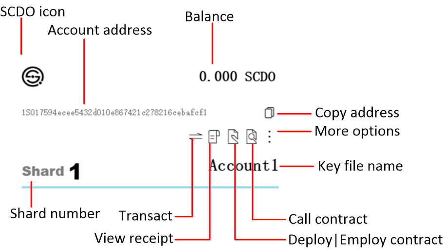

# Account

## Manage Accounts

**Import**

1. Click [Import Keyfile(s)] (menu > File > Import Keyfile(s)) to open file explorer.
2. Select your keyfile.
3. Click [Import] to import, or [cancel] to cancel import.

**Create**

1. Click [Create Keyfile(s)] (menu > File > Create Keyfile(s)) to show create board.
2. Enter keyfile name: do no leave blank or duplicate with existing keyfiles.
3. Enter privatekey or not:
  - Enter an exising privatekey: enter a SCDO Privatekey (starts with 0x with a total length of 66) ```example: 0x0fb46105b962b90d11ca7dcdee2551ec9ed3110b888c24a0832b84a57ca6f41c```.
  - Leave privatekey empty:  will genenrate a random privatekey
4. Enter Shard (1-4) ```example: 3```.
4. Enter password: must be 8 to 15 characters including lower & upper case letters, numbers and special characters.```example: 1NormalGuy!```.
5. Click [Create Keyfile] to create, or click on grey area to exit create board.

**Move**

1. On account card, click [more options] to show more options board.
2. On more options board, click [move keyfile] to open file explorer, select move destination.
3. Click [export] to move keyfile, or [cancel] to close file explorer, then grey area to close options board.

## Account functions



# Nodes

---
## monitor and modify wallet connected nodes

1. Click on [Show NetWork Info] (menu > view > Show NetWork Info) to toggle node info section on front page: shard, address, version, synchronization(height and time since last block was created).
2. Click on [Edit NetWork Info] (menu > view > Edit NetWork Info) to toggle network editing board. Clicking on the surrounding grey area will exit the board without saving changes.
3. Enter the new address you wish to add in shard1 (or any shard): `example: 127.0.0.1:8037`
4. Click [Save node changes], exit the board, refresh(ctr+r) wallet to update the change, and verify the change using Show NetWork Info.

---
## monitor and modify backup nodes
1. Click on [Edit NetWork Info] (menu > view > Edit NetWork Info) to toggle network editing board. Clicking on the surrounding grey area will exit the board without saving changes.
2. Type in address at [add to monitor]```example: 127.0.0.1:8037```。
3. Click [save node changes], then click [refresh node info] to view node information on the board：
  * Peers：```total peers connected（peers from shard1, …2, …3, …4）```
4. Delete backup nodes：click on the right most ```x``` of each line of node display then click [save node changes]。

# Transactions

## Send Transactions

1. Get the receiving address
  - If the address is from within the wallet, you may click [copy publickey] on account display
2. Enter transaction page
  - Find the account to send the transaction and click [Transact] on account display
3. Enter transaction information
  - Enter receiving address, account password, amount ( total = send amount + fee (default 0.00021 SCDO) ). Cross shard transactions require higher fees (default 0.00063 SCDO) and will wait longer for confirmation
4. Click Send
  - Click [Send] to broadcast the transaction (or [cancel] to return to front page). If the wallet shows "broad cast successfully", click [ok] to return to front page.

Note: pay attention to the nodes wallet connect to, latency in synchronization may cause transactions to fail.

## View Transaction Status

- Users may check the transactions status in the Transaction List section. The status could be ```Wait``` or ```Done```. The number next to status is the shard that the transaction belongs to (1→2 meaning a cross-shard transaction from shard1 to shard2). It takes 20-30 seconds for a same shard transaction to complete, and 40-60 minutes for a cross-shard transaction.
- In the case of a cross shard transaction, expect the balance of the sending account to decrease first, and wait for 40-60 minutes for the balance to increase on the receiving account.
